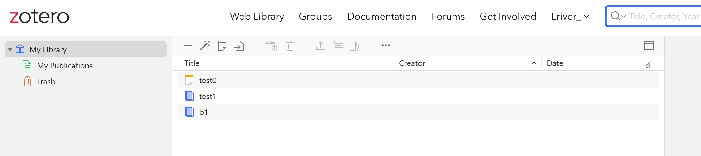
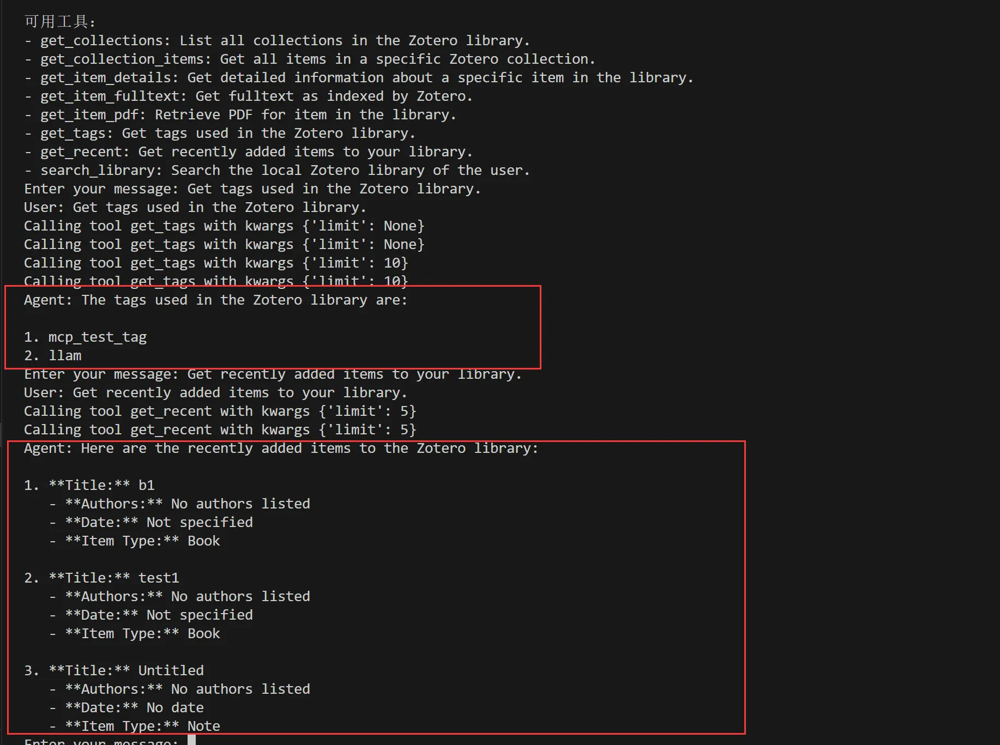

# zotero_mcp
[English](./README.md) | [中文](./README_zh.md)

Support connecting Zotero via MCP with a custom server and client, without the need for tools like the Claude app or Cursor.

## Run Server

First, create a `.env` file and fill in the following variables. `zotero_api_key` needs to be obtained from the Zotero official website, and `api_key` is your LLM's API key:

```
zotero_api_key=''
api_key=""
```

Then start the server:
```bash
python ./server.py
```

Open a new terminal window and run the client:
```bash
python ./client.py
```

Here's the testing result:

Upload files in Zotero in advance:



Query document content via MCP:



#### Detailed explanation will be updated soon
