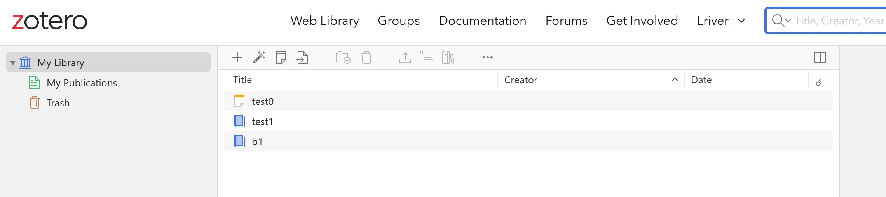
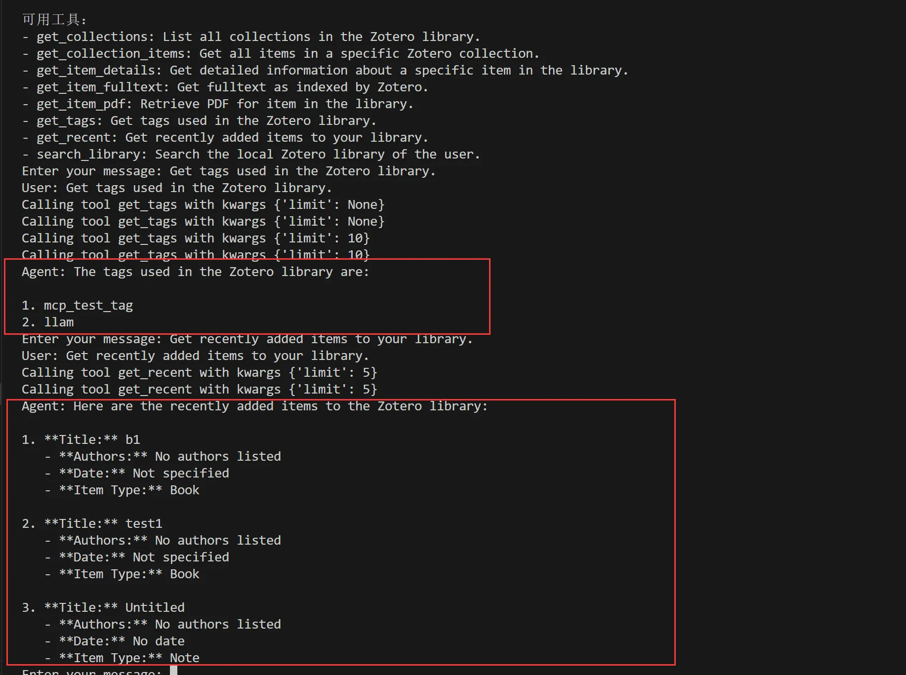

# zotero_mcp
[中文](./README_zh.md) | [English](./README.md)

支持通过 MCP 协议连接 Zotero，包含自定义的服务端和客户端，无需依赖如 Claude 应用、Cursor 等工具。

## 运行服务端

首先创建 `.env` 文件，并填写以下变量。其中 `zotero_api_key` 需要前往 Zotero 官网申请，`api_key` 是 LLM 的 API Key：

```
zotero_api_key=''
api_key=""
```

然后启动服务端：
```bash
python ./server.py
```

打开一个新的终端窗口，运行客户端：
```bash
python ./client.py
```

测试效果如下：

提前在 Zotero 中上传文件：



通过 MCP 接入 Zotero，查询文档内容：



#### 详细说明将尽快更新